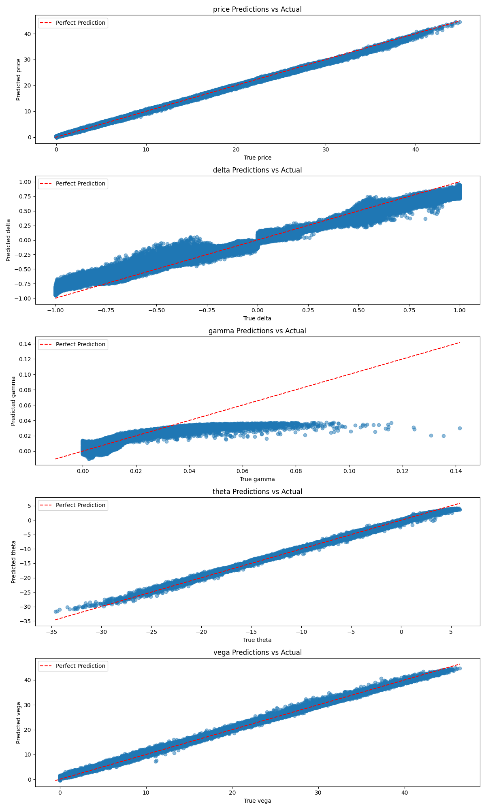
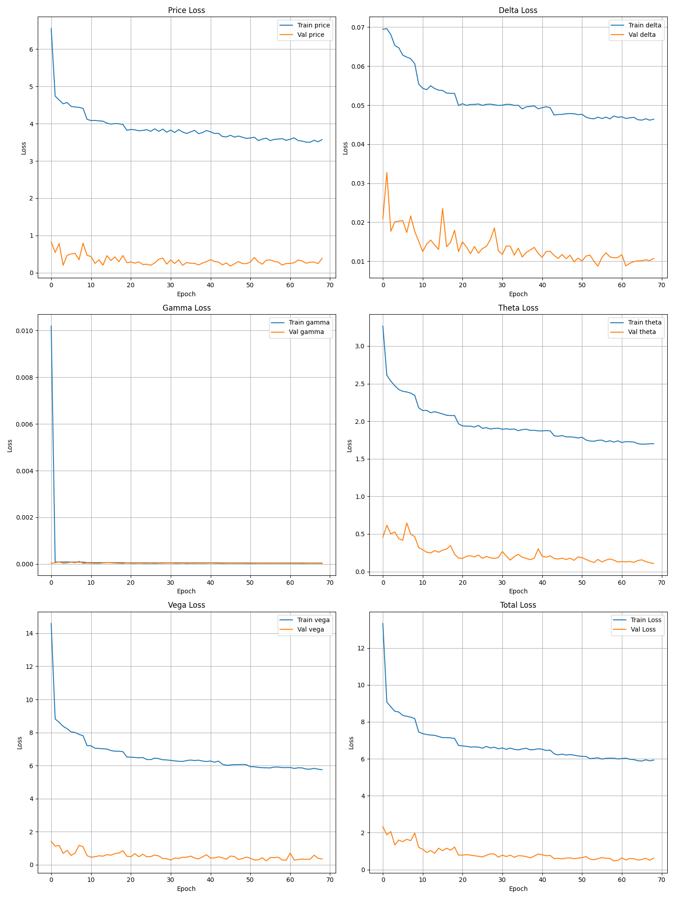
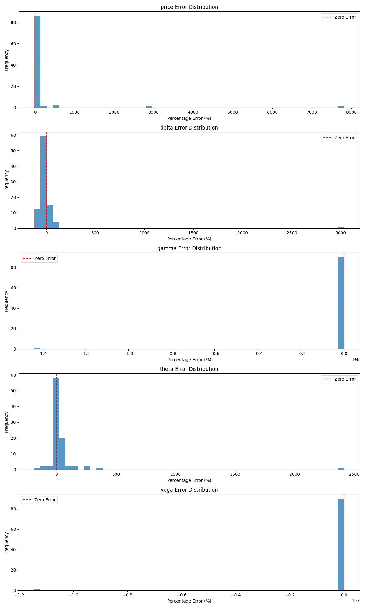

# TensorFlow/Keras Option Pricing Model

This project implements a deep learning approach to option pricing using TensorFlow/Keras. The model combines feedforward neural networks (FNN), recurrent neural networks (RNN), and decoder networks to accurately price options based on the Black-Scholes model.

## Project Structure

```
├── data/              # Generated datasets
│   ├── train.csv     # Training data (80%)
│   ├── val.csv       # Validation data (10%) 
│   └── test.csv      # Test data (10%)
├── src/              # Source code
│   ├── data_gen.py   # Dataset generation script
│   ├── model.py      # Neural network model implementation
│   ├── train.py      # Training script
│   └── test.py       # Testing and visualization script
└── README.md         # Project documentation
```

## Installation

```bash
pip install tensorflow numpy pandas matplotlib scipy scikit-learn
```

## Usage

### 1. Generate Dataset

Generate sample option pricing dataset using Black-Scholes formula:

```bash
python src/data_gen.py --num_samples 100000
```

This will create train/validation/test datasets in the data/ directory with the following features:
- Spot price (S)
- Strike price (K)
- Time to maturity (T)
- Risk-free rate (r)
- Volatility (σ)
- Option type (Call=1, Put=0)

And these targets:
- Option price
- Delta
- Gamma
- Theta
- Vega

### 2. Train Model

Train the neural network model:

```bash
python src/train.py
```

The model architecture consists of:
1. A feedforward neural network (FNN) that processes global market information
2. A recurrent neural network (RNN) that handles temporal dependencies
3. A decoder network that generates final option prices

### 3. Test Model

Test the model and generate visualization plots:

```bash
python src/test.py
```

This will:
1. Load the trained model
2. Evaluate performance on test dataset
3. Generate comparison plots between predicted and actual prices
4. Calculate and display error metrics

#### Result Plot







## Model Architecture

### Feedforward Neural Network (FNN)
- Processes global market features
- Multiple dense layers with ReLU activation
- Batch normalization for training stability

### Recurrent Neural Network (RNN): TBN Not in use for now
- LSTM layers for temporal dependencies
- Processes market state evolution
- Handles time-series aspects of option pricing

### Decoder Network
- Converts latent space representations to option prices
- Dense layers with appropriate activation functions
- Final layer outputs option price and Greeks

## Training Process

1. Data preprocessing and normalization
2. Mini-batch training with Adam optimizer
3. Early stopping to prevent overfitting
4. Learning rate scheduling for optimal convergence

## Performance Metrics

The model is evaluated on:
- Mean Squared Error (MSE)
- Mean Absolute Percentage Error (MAPE)
- R-squared score
- Greeks accuracy comparison

## References


### Mathematical Foundation

#### Option Pricing Background

The Black-Scholes model is the traditional approach for option pricing, defined by the partial differential equation:

$$\frac{\partial V}{\partial t} + \frac{1}{2}\sigma^2S^2\frac{\partial^2 V}{\partial S^2} + rS\frac{\partial V}{\partial S} - rV = 0$$

Where:
- $V$ is the option price
- $S$ is the underlying asset price
- $t$ is time
- $r$ is the risk-free interest rate
- $\sigma$ is the volatility

Our neural network approach generalizes this by learning non-linear relationships without making strong assumptions about market dynamics.

#### The Greeks

The Greeks measure sensitivities of option prices to various factors:

- **Delta (Δ)**: $\frac{\partial V}{\partial S}$ - Sensitivity to underlying price
- **Gamma (Γ)**: $\frac{\partial^2 V}{\partial S^2}$ - Rate of change of Delta
- **Theta (Θ)**: $\frac{\partial V}{\partial t}$ - Time decay
- **Vega**: $\frac{\partial V}{\partial \sigma}$ - Sensitivity to volatility

### Model Architecture

The model employs a hybrid architecture with three main components:

#### 1. Feedforward Neural Network (FNN)

The FNN captures static market features through a series of dense layers:

$$f_{\text{FNN}}(x) = W_L \cdot \sigma(W_{L-1} \cdot ... \sigma(W_1 \cdot x + b_1) ... + b_{L-1}) + b_L$$

Where σ is the ReLU activation function: σ(x) = max(0, x)

#### 2. Recurrent Neural Network (RNN)

The LSTM-based RNN captures temporal dependencies in market data:

$$h_t = \text{LSTM}(x_t, h_{t-1})$$

The LSTM cell computes:
- $f_t = \sigma(W_f \cdot [h_{t-1}, x_t] + b_f)$ - forget gate
- $i_t = \sigma(W_i \cdot [h_{t-1}, x_t] + b_i)$ - input gate
- $o_t = \sigma(W_o \cdot [h_{t-1}, x_t] + b_o)$ - output gate
- $c'_t = \tanh(W_c \cdot [h_{t-1}, x_t] + b_c)$ - candidate cell state
- $c_t = f_t \odot c_{t-1} + i_t \odot c'_t$ - cell state update
- $h_t = o_t \odot \tanh(c_t)$ - hidden state

#### 3. Decoder Network

The decoder maps the latent representation to option prices and Greeks:

$$\begin{aligned}
\text{Price}, \Delta, \Gamma, \Theta, \text{Vega} = g(\text{Concat}[f_{\text{FNN}}(x_{\text{static}}), f_{\text{RNN}}(x_{\text{temporal}})])
\end{aligned}$$

### Training Process

The model minimizes a weighted multi-task loss function:

$$L(\theta) = \text{MSE}_{\text{price}} + \lambda_{\Delta}\cdot\text{MSE}_{\text{delta}} + \lambda_{\Gamma}\cdot\text{MSE}_{\text{gamma}} + \lambda_{\Theta}\cdot\text{MSE}_{\text{theta}} + \lambda_{\text{vega}}\cdot\text{MSE}_{\text{vega}}$$

Where the weights balance the importance of accurately predicting each quantity.

### Data Preprocessing

Features are standardized using Z-score normalization:

$$z = \frac{x - \mu}{\sigma}$$

Where μ is the mean and σ is the standard deviation of the training data.

### Advantages Over Traditional Methods

1. **Adaptability**: Learns market patterns without explicit modeling
2. **Non-linearity**: Captures complex non-linear relationships
3. **Feature Learning**: Automatically extracts relevant features
4. **Temporal Awareness**: Incorporates historical data patterns
5. **Joint Estimation**: Simultaneously predicts price and Greeks with shared representations


#### Evaluation

The model is evaluated on test data using:
- Mean Squared Error (MSE): $E[(y - \hat{y})^2]$
- Mean Absolute Error (MAE): $E[|y - \hat{y}|]$
- Mean Absolute Percentage Error (MAPE): $E[|\frac{y - \hat{y}}{y}|] \times 100\%$
- Correlation Coefficient: $\rho_{y,\hat{y}}$

